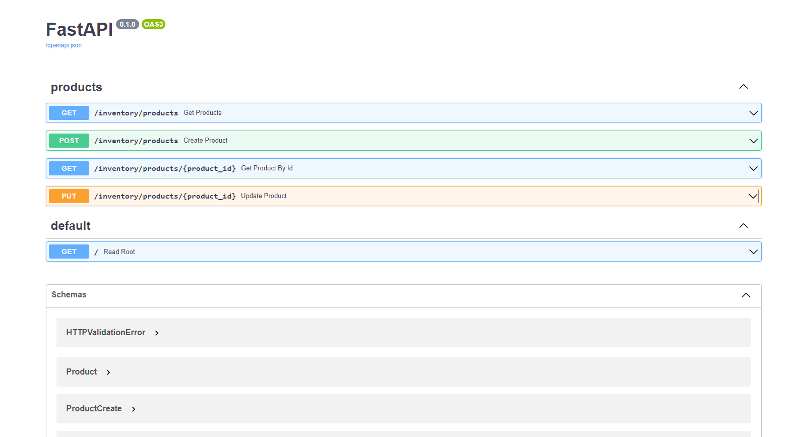
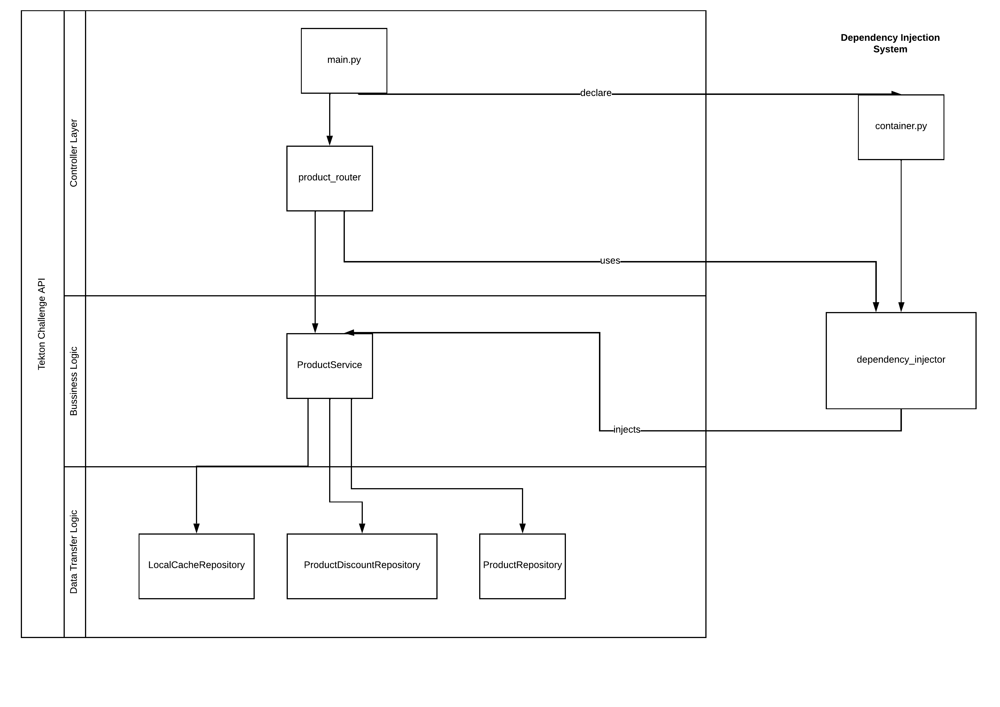

# Tekton Challenge

---

## How to run it

### Create virtual environment

    python -m venv venv

### Activate virtual environment

#### Windows:

    PS C:\> <venv>\Scripts\Activate.ps1

#### Linux:

    source <venv>/bin/activate

### Install dependencies

    pip install -r requirements.txt

### In production

    uvicorn tekton_challenge.main:app --reload --log-config ./tekton_challenge/log.ini

### In development

    python ./tekton_challenge/main.py

### Open API docs

    http://localhost:8000/docs

## How to test it

### Running tests with

    pytest

## Folder structure

    ├── app.db                              
    ├── logfile.log                         
    ├── README.md                           
    ├── requirements.txt                    
    ├── tekton_challenge                    
    |  ├── config                           
    |  ├── container.py                     
    |  ├── log.ini                          
    |  ├── main.py                          
    |  ├── models                           
    |  ├── repositories
    |  ├── routers
    |  ├── schemas
    |  ├── services
    |  └── __init__.py
    └── tests
       ├── conftest.py
       ├── routers
       ├── services
       ├── test_main.py
       └── __init__.py

* `app.db`: sqlite database created when the system runs
* `logfile.log `: files where the logs are stored
* `tekton_challenge/config`: folder where database and settings are stored
* `tekton_challenge/cotainer.py`: container of the fastapi app, it's where dependency injection is done
* `tekton_challenge/log.ini`: logging configuration
* `tekton_challenge/main.py`: entry file to run the application
* `tekton_challenge/models`: SQLAlchemy models
* `tekton_challenge/repositories`: Data access object implementation
* `tekton_challenge/services`: Business logic implementation
* `tekton_challenge/schemas`: Pydantic schemas for class validation and serialization/CQRS Implementation
* `tekton_challenge/routers`: API Endpoints/Controller
* `tests/`: Tests of the application

## Components Layered Diagram

